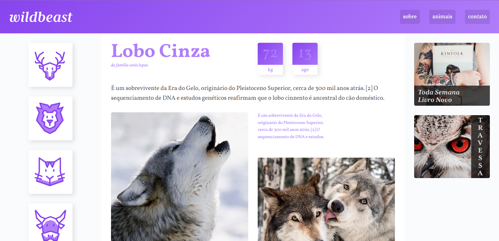

<h1 align="center">
  Wildbeast
</h1>

  

## 💻 Projeto

O **Wildbeast** é um projeto criado para demonstrar o uso do **CSS Grid** em layouts responsivos. O layout simula um blog e foca na organização de elementos utilizando o sistema de grid do CSS.

## 🚀 Tecnologias

- HTML
- CSS

## 📔 Conhecimentos abordados

- [x] Utilização do **CSS Grid** para construção de layouts responsivos
- [x] Criação de um layout simulado de blog com grid
- [x] Uso semântico do HTML
- [x] Estilização responsiva com CSS

## 📺 Finalidade

Este projeto tem como objetivo demonstrar a aplicação do **CSS Grid** na construção de layouts modernos e responsivos, proporcionando uma experiência de aprendizado para desenvolvedores iniciantes.

## 📬 Contato

Em caso de dúvidas ou sugestões, entre em contato:

- **Email**: devgabrielsilveira@gmail.com
- **LinkedIn**: https://www.linkedin.com/in/gabriel-silveira-67979b18a/

Desenvolvido por Gabriel Silveira 🚀
